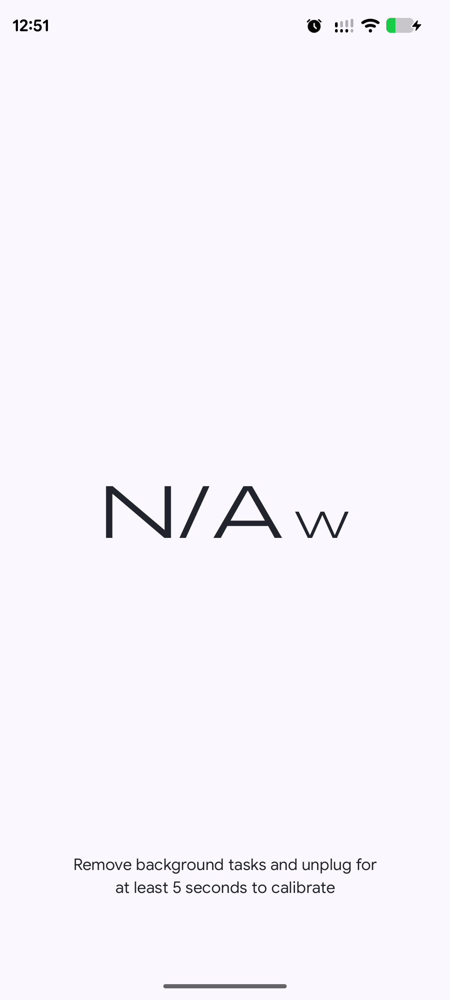
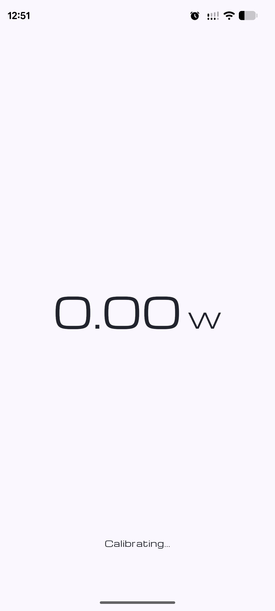

# Wattt! ⚡

**Wattt!** is a minimalist Android app that shows the **real charging power** your phone is drawing from its charger — in watts, live, as it charges.

Most phones don't tell you how fast they're actually charging. Wattt! reads your battery's voltage and current directly and does the math for you, accounting for the power your phone consumes just by being on. The result: a single, honest wattage number.

<p align="center">
  
</p>

## Features

- **⚡ Live charging wattage** — see real-time charging power as a big, clear `XX.XX W` readout.
- **🎯 System-consumption calibration** — measures how much power your phone uses on its own (screen, background tasks) so the wattage reflects what your charger is *actually* delivering, not just what reaches the battery.
- **📊 Direct battery readings** — uses Android's `BatteryManager` to read live voltage and current; no root, no extra permissions.
- **🪶 Minimal & distraction-free** — one screen, one number. No ads, no accounts, no tracking.
- **🎨 Edge-to-edge Material 3 UI** — built entirely with Jetpack Compose and a clean monospace (Michroma) display font.

## How it works

When your phone is **unplugged**, Wattt! watches the battery's discharge current to learn how much power the device draws on its own (the *system consumption offset*). This takes about **5 seconds** to calibrate.

When you **plug in**, the displayed wattage combines:

```
Charging power (W) = Voltage (V) × (Charge current + System consumption)
```

This gives a closer estimate of the **true power coming from the charger**, rather than only the current flowing into the battery.

> While charging before calibration, the app shows `N/A` and asks you to briefly unplug to calibrate.

## Calibration steps

1. Open the app while **unplugged**.
2. Leave it for **at least 5 seconds** (closing heavy background apps improves accuracy) — you'll see `Calibrating...`.
3. **Plug in your charger** — the live wattage appears.

## Screenshots

| Needs Calibration | Calibrating | Charging | Charging |
|:---:|:---:|:---:|:---:|
|  |  |  |  |
| Plugged in, no calibration yet | Unplugged — measuring idle draw | 12.20 W via fast charger | 8.56 W via standard charger |

## Requirements

- **Android 12 (API 31)** or newer
- A device that reports battery current via `BATTERY_PROPERTY_CURRENT_NOW` (most modern phones)

## Tech stack

- **Kotlin**
- **Jetpack Compose** + **Material 3**
- **Android `BatteryManager`** for live battery telemetry

## Installation

See **[INSTALL.md](INSTALL.md)** for download, sideloading, and build-from-source instructions.

## License

Add your license of choice here (e.g. MIT).

---

<p align="center">Made with ⚡ — because your charger's rating isn't always the truth.</p>
